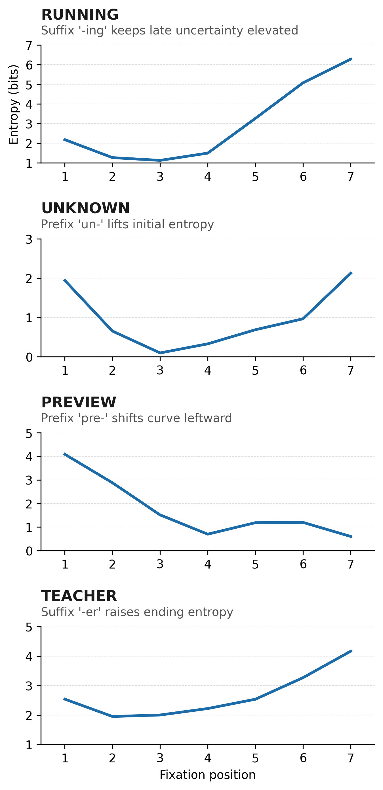

# Initial Landing Position Entropy

A fast Python toolkit for computing ILP entropy curves: the uncertainty (bits) over word identity given a fixation point. Works on any corpus with `word,freq` columns; defaults are set up for OpenSubtitles English and Hebrew.

<p align="center">
  
</p>

## Quick start
```bash
python scripts/main.py \
  --corpus-file data/opensubtitles_en.csv \
  --all-corpus-words \
  --min-freq 1e-6 \
  --drop-left 0.25 \
  --drop-right 0.25 \
  --word-lengths 4 5 6 7 8 9 10
# outputs to output/run_<timestamp>/results.csv (+ metadata.json)
```

- Sweep drops instead of fixed values: `--sweep-left '0.1,0.9,0.1' --sweep-right '0.1,0.9,0.1'`
- Restrict to a list: replace `--all-corpus-words` with `--word-list path/to/list.txt`
- Control workers: `--workers N` (defaults to CPU count)

Convenience scripts:
- `./run_simple.sh` — one preset run (drops 0.1/0.2, lengths 4–10)
- `./run_sweep.sh` — full grid sweep (0.1–0.9 step 0.1, lengths 4–10)

## What it does (under the hood)
- Loads and filters the corpus (`src/io.py`), builds per-length indices (`scripts/main.py`).
- Computes acuity-weighted mask probabilities (`src/acuity.py`, `src/probability.py`, `src/masks.py`).
- JITs the candidate-set entropy loop with Numba and aggregates to position-wise ILP entropy (`src/entropy.py`).

## Typical outputs
- `results.csv`: one row per word and position with entropy plus the drop parameters used.
- `metadata.json`: arguments used for the run.
- Optional plots: `visualization/plot_results.py` or `visualization/plot_by_length.py` on a run directory.

## Corpora
- English: `data/opensubtitles_en.csv`, `data/wikipedia_en.csv`
- Hebrew (converted): `data/opensubtitles_he.csv` (accepts Hebrew letters; see `src/io.py` for allowed characters)

## Environment
Requires Python 3.11+, `numpy`, `pandas`, `tqdm`, `matplotlib`, `numba`, `seaborn`. Install via `pip install -r requirements.txt`.
